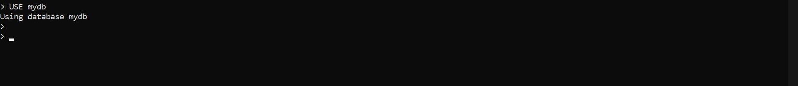

# Latihan 1 (Install InfluxDB)
InfluxDB adalah database time series yang dibagun untuk menangani baca tulis yang tinggi. 
InfluxDB digunakan sebagai database untuk menampung data timestamp yang banyak, mencakup Devops Monitoring, 
metrik aplikasi dan real-time analytics.

Kemudian berhasil masuk ke influxd.exe, user membuka commandpromp baru dan Menjalankan influx.exe akan memulai CLI dan secara otomatis terhubung ke instance InfluxDB lokal (dengan asumsi Anda telah memulai server dengan start layanan influxdb atau dengan menjalankan influxd secara langsung).

# Latihan 2 (Kerjakan perintah-perintah dasar di InfluxDB)
membuat database dan Nama-nama basis data dapat berisi karakter unicode apa pun selama string tersebut dikutip ganda. Nama juga dapat dibiarkan tanda kutip jika hanya berisi huruf, digit, atau garis bawah ASCII dan tidak dimulai dengan angka. Disini user menggunakan nama database mydb

Dilanjutkan dengan menggunakan pernyataan SHOW DATABASES untuk menampilkan semua database yang ada

SHOW DATABASES, sebagian besar pernyataan InfluxQL harus beroperasi terhadap basis data tertentu. Tetapi secara eksplisit memberi nama database dengan setiap permintaan, tetapi CLI memberikan pernyataan kenyamanan, USE , yang secara otomatis akan memilih dan mengatur database untuk semua perintah yang dijalankan.Untuk menyisipkan titik data seri waktu tunggal ke InfluxDB menggunakan CLI, masukkan INSERT diikuti oleh sebuah titik, dimana titik tersebut dengan nama pengukuran host dan wilayah cpu dan tag kini telah ditulis ke basis data, dengan nilai terukur 0,64. Dan kemudian menampilkan data yang disimpan pada database menggunakan perintah SELECT.

Kemudian untuk menampilkan semua bidang

influxQL memiliki banyak fitur dan kata kunci yang tidak tercakup
