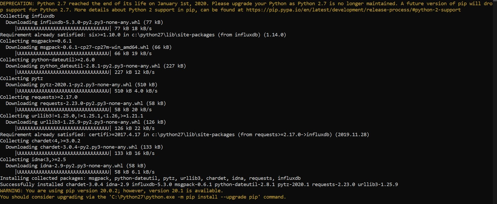
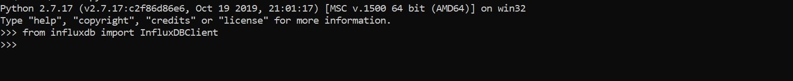
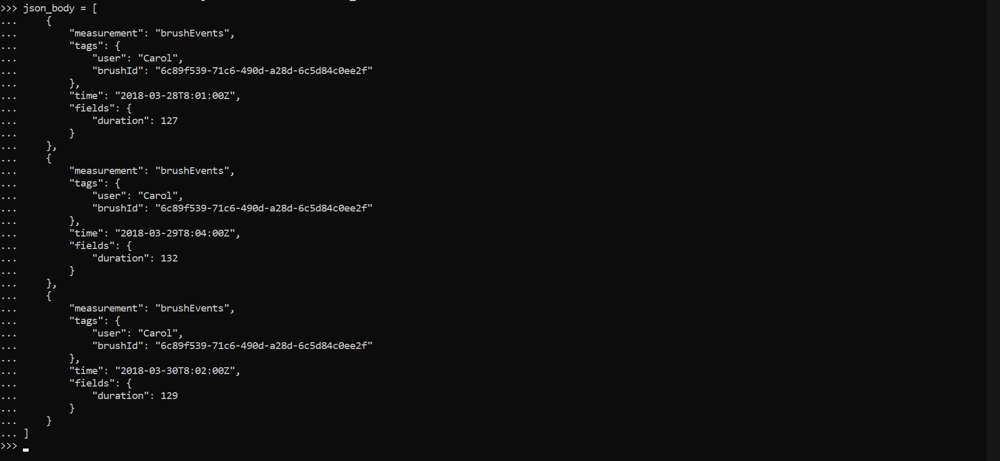
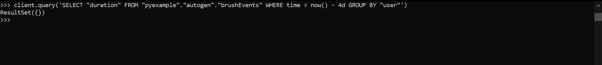
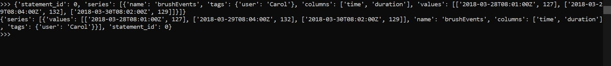

# tekn-basis-data
# Latihan 1 
influxdb dengan menjalankan pip menggunakan argumen -m ke perintah Python, untuk memastikan Python mana yang menjadi target instal.

kemudian masuk ke python kemudian dilanjutkan impor InfluxDBClient dari pustaka python-influxdb untuk memastikan sudah di terpasang.

membuat instance baru dari InfluxDBClient (API docs), dengan informasi tentang server yang ingin di akses. Masukkan perintah berikut di REPL Anda, ganti nilai host dan port dengan URL / alamat IP dan port host InfluxDB yang sesuai. 

membuat database baru dengan nama ‘examplepy’ untuk menyimpan data dan dapat memeriksa apakah databasenya ada dengan menggunakan fungsi get_list_database () dari clien:

insert data, untuk memasukkan beberapa data user akan menggunakan metode write_points () clien untuk melakukannya (API docs). Metode ini mengambil daftar poin dan beberapa parameter tambahan termasuk "batch size", yang memberi kemampuan untuk memasukkan data dalam batch sebagai lawan dari semuanya sekaligus. Ini bisa bermanfaat jika Anda memasukkan data dalam jumlah besar. Metode write_points () memiliki argumen yang disebut poin, yang merupakan daftar kamus, dan berisi poin yang akan ditulis ke database. Pertama, user menambahkan tiga poin dalam format JSON ke variabel yang disebut json_body

selanjutnya input default untuk write_points () adalah JSON dapat memanggil metode itu menggunakan variabel json_body kita sebagai satunya argument.beberapa data User akan menggunakan objek clien yang sama seperti yang di gunakan untuk menulis data, kecuali kali ini kami akan menjalankan query di InfluxDB dan mendapatkan kembali hasilnya menggunakan fungsi kueri () klien kami () (dokumen API)

raw untuk mengakses respons JSON mentah dari InfluxDB

