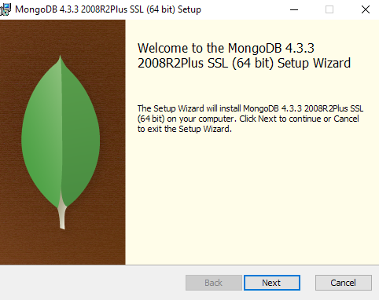
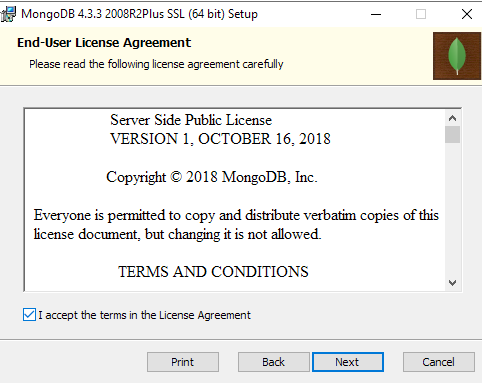
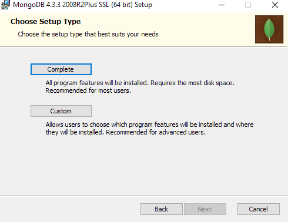

# tekn-basis-data
# Latihan 1 (Instalasi MonggoDB)
Langkah — 1 Download MongoDB
Latihan pada praktik 2 ini yaitu menginstal aplikasi MongoDB.
MongoDB terdapat dua versi yaitu enterpise dan comunity. Kita akan menggunakan versi komunitas. untuk download mongoDB anda dapat kunjungi link disini. Pastikan anda memilih Package Msi untuk OS windows. Bagi OS selain Windows menyesuaikan dengan OS anda.
Langkah 2 — Install MongoDB
Setelah mendownload MongoDB. Kemudian klik kanan package yang telah di download dan pilih Instal. Atau anda dapat melakukannya dengan cara double klik.
Klik tombol next, untuk melanjutkan instalasi.

Centang box “i accept the terms in the license agreement” kemudian klik next untuk melanjutkan instalasi.

Klik Tombol Complate  karna kita akan meletakan instalasi mongodb pada partisi C:

klik tombol browse untuk mengubah lokasi default instalasi
Anda dapat menentukan dimana saja lokasi instalasi mongodb yang anda inginkan. Namun untuk tutorial kali ini saya meletakan di partisi C:
saya meletakan instalasinya pada C:\MongoDB. dan folder MongoDB harus dibuat terlebih dahulu.
Setelah lokasi telah di tentukan pada direktori C:\MongoDB. kemudian klik tombol next

Pilih Radio box “Run MongoD as a Services. Kemudian klik next untuk melanjutkan

.png)

Hilangkan centang Install mongoDB Compass dan klik tombol next untuk melanjutkan proses intalasi.

.png)

Klik tombol intalasi untuk untuk memulai instalasi mongoDB pada komputer. Apabila terdapat combo box klik oke dan Tunggu proses instalasi sampai selesai

.png)

Klik finish untuk mengakhiri proses instalasi

# Latihan 2	- Menjalankan MongoDB server dengan menggunakan mongo shell
Jika Mongodb berhasil terinstall, maka langkah selanjutnya yaitu membuka cmd (Command Prompt). Kemudian kita akan masuk ke dalam direktori dimana file MongoDB tersimpan dengan cara cd C:\Program Files\MongoDB\Server\4.3\bin atau bisa juga dicopy pada alamat direktori pada file explorer. Apabila sudah masuk dalam direktori MongoDb ketik mongod lalu tekan enter, maka akan muncul proses seperti pada gambar dibawah.

.png)

Jika proses berhasil, user akan membuat folder baru di direktori C:\ dengan nama data. Kemudian didalam folder data tersebut, buatlah folder baru lagi dengan nama db.

.png)
.png)

Lalu kembali lagi di Command Prompt, kemudian ketik mongo dan tekan enter maka akan muncul proses lagi seperti gambar dibawah.

.png)
 
Jika proses sudah berhasil, kembali dan masuk ke folder data db apabila muncul file-file seperti pada gambar dibawah maka file Mongodb berhasil dibuat.

.png)

Kembali lagi ke Command Prompt kemudian ketik mongo dan tekan enter, jika hasil proses seperti dibawah maka Mongodb server berhasil dijalankan dengan menggunakan akases mongo shell.

.png)
 
# Langkah 3 — Membuat Folder Data Untuk Menyimpan Database.

Buat folder baru yang bernama data. Anda boleh menepatkan dimanapun folder data. Namun kali ini saya membuat folder data didirektori C:

.png)

kita membuat folder baru lagi bernama db didalam C:\data.

.png)

# Langkah 4 — Menjalankan MongoDB dengan Cara Manual

anda membuka comand prompt (cmd)

.png)

anda mengetikan perintah C:\MongoDB\bin\mongod.exe — dbpath=C:\data\db

.png)

Apabila keluar tulisan seperti ini artinya anda telah berhasil menginstal mongoDB dan menjalankannya MongoDB secara manual

.png)

# Latihan 3 (Kerjakan Getting Started)
Tab 0
>db menunjukkan bahwa merujuk ke database saat ini atau database yang sedang aktif.

.png)

use examples menunjukkan bahwa berpindah database, dimana untuk beralih ke database examples

.png)

Tab 1
Contoh berikut menggunakan metode db.collection.insertMany() menunjukkan untuk menyisipkan dokumen baru yang lebih dari satu atau lebih ke dalam collection inventory. 
.png)

Tab 2
db.inventory.find merujuk untuk melihat semua dokumen pada collection inventory.
.png)

db.inventory.find().pretty merujuk untuk melihat semua dokumen pada collection inventory dengan tampilan yang teratur atau tersusun rapih dalam arti dipercantik susunan dokumen.

.png)
.png)
.png)
.png)

Tab 3
db.inventory.find merujuk untuk shell dokumen yang bidang isinya sama dengan huruf"D" :
.png)
db.inventory.find merujuk untuk shell dokumen yang bidang isinya sama dengan angka "0" :
.png)
 
db.inventory.find merujuk untuk shell dokumen yang bidang isinya sama dengan angka"0" dan huruf”d”:
.png)
 
db.inventory.find merujuk untuk shell dokumen yang bidang isinya adalah size.oum sama dengan "in" :
.png)
 
db.inventory.find merujuk untuk shell dokumen yang bidang isinya adalah size.oum sama dengan "cm", h sama dengan “14” dan w sama dengan “21” :
.png)
db.inventory.find merujuk untuk shell dokumen yang bidang isinya adalah tags sama dengan "red" :
.png)
 db.inventory.find merujuk untuk shell dokumen yang bidang isinya adalah tags sama dengan "red" dan “blank” :
.png)
.png)
.png)
 
Tab 4
db.inventory.find merujuk untuk shell dokumen yang bidang isinya adalah item sama dengan "1" dan status sama dengan “1” :
.png)

db.inventory.find merujuk untuk shell dokumen yang bidang isinya adalah _id sama dengan "0", item sama dengan “1” dan status sama dengan “1” :
.png)
 
# Latihan 4	CRUD pada materi dan penjelasan nomor 2
CREATE Diartikan yaitu MEMBUAT atau masukkan operasi, dimana menambahkan dokumen baru ke dalam collection. Jika collection saat ini tidak ada, operasi akan membuat collection. Didalam MongoDB terdapat dua method untuk menambahkan dokumen dalam collection yakni :
insertOne() dimana menginsert atau menambahkan satu data kedalam collection.
Contoh menambahkan 1 dokumen baru ke dalam koleksi inventory . Jika dokumen tidak menentukan bidang _id , MongoDB menambahkan bidang _id dengan nilai ObjectId ke dokumen baru.

.png)
 
insertMany() dimana menginsert atau menambahkan data yang lebih dari satu kedalam collection.
Contoh menambahkan beberapa dokumen baru ke dalam koleksi inventory . Jika dokumen tidak menentukan bidang _id , MongoDB menambahkan bidang _id dengan nilai ObjectId ke setiap dokumen. 
.png)
 
    Contoh insertOne pada [Getting Started](https://docs.mongodb.com/manual/crud/)
.png)

READ Diartikan yaitu MEMBACA atau mengambil dokumen dari collection. Berikut dalam MongoDB terdapat method untuk meminta collection untuk dokumen.
Query Document
Menampilkan semua Dokumen, Gambar dibawah ini memberikan contoh operasi query menggunakan metode db.collection.find() di mongo shell. 
Contoh di halaman ini menggunakan collection inventory . Untuk mengisi koleksi inventory, jalankan yang berikut :
.png)
Untuk menampilkan semua dokumen dalam collection yaitu dengan query seperti pada contoh gambar dibawah bedanya dengan mysql yaitu menggunakan query select*from sedangkan nosql menggunakan sytak find().
Menampilkan dokumen sesuai dengan kondisi yang spesifik, dalam nosql dapat menggunakan operator kueri untuk menentukan kondisi dalam formulir. 
Berikut contoh mengambil semua dokumen dari collection inventory mana status sama dengan "D" :
Contoh berikut mengambil semua dokumen dari collection inventory mana status sama dengan "A" atau "D" :
Menampilkan dokumen sesuai dengan kondisi dan spesifikasi dimana query majemuk dapat menentukan kondisi untuk lebih dari satu bidang dalam dokumen koleksi. Secara implisit, logika AND konjungsi menghubungkan klausa dari query gabungan sehingga kueri memilih dokumen dalam collection yang cocok dengan semua kondisi. 
Contoh berikut mengambil semua dokumen dalam koleksi inventory mana status sama dengan "A" dan qty 
Menampilkan dokumen sesuai dengan kondisi dan spesifikasi dimana menggunakan $or operator, yang dapat menentukan query gabungan yang bergabung dengan setiap klausa dengan logika OR konjungsi sehingga kueri memilih salah satu dokumen dalam collection yang cocok dengan setidaknya satu kondisi.
Contoh berikut mengambil semua dokumen dalam collection di mana status sama dengan "A" atau qty kurang dari ( $lt ) 30 :
Spesifikasi AND serta OR Kondisi
Dalam contoh berikut, dokumen query gabungan memilih semua dokumen dalam collection di mana status sama dengan "A" dan jumlah qty kurang dari ( $lt ) 30 atau item dimulai dengan karakter p :
UPDATE diartikan yaitu MEMPERBAHARUI dimana suatu dokumen dalam collection untuk memperbarui dan mengubah nilai-nilai dokumen. Untuk menggunakan operator pembaruan, terdapat 3 metode pembaruan dokumen pembaruan bentuk yaitu:
Perbarui Satu Dokumen
Dalam contoh berikut menggunakan metode db.collection.updateOne() pada koleksi inventory untuk memperbarui dokumen pertama di mana item sama dengan "paper" :
Perbarui beberapa dokumen
Contoh berikut menggunakan metode db.collection.updateMany() pada koleksi inventory untuk memperbarui semua dokumen dengan jumlah qty kurang dari 50 :
Operasi pembaruan :
-	menggunakan $set operator untuk memperbarui nilai bidang size.uom ke "in" dan nilai bidang status ke "P" ,
-	menggunakan operator $currentDate untuk memperbarui nilai bidang lastModified ke tanggal saat ini. Jika bidang lastModified tidak ada, $currentDate akan membuat bidang tersebut. Lihat $currentDate untuk detailnya.
Ganti Dokumen
Untuk mengganti seluruh konten dokumen kecuali _idbidang, dokumen yang sama sekali baru sebagai argumen kedua db.collection.replaceOne().
Saat mengganti dokumen, dokumen pengganti harus terdiri dari hanya pasangan bidang atau nilai; yaitu tidak termasuk ekspresi operator pembaruan. Dokumen pengganti dapat memiliki bidang berbeda dari dokumen asli. Dalam dokumen pengganti, user dapat menghilangkan _idbidang karena _idbidang tidak dapat diubah; Namun, jika user menyertakan _idbidang, itu harus memiliki nilai yang sama dengan nilai saat ini.
Contoh berikut menggantikan dokumen pertama dari inventorykoleksi tempat :item: "paper"
DELETE diartikan yaitu MENGHAPUS dimana digunakan untuk menghapus dokumen pada collection. Untuk menggunakan operator hapus, terdapat 3 metode untuk menghapus dokumen yaitu:
Menghapus semua dokumen
Untuk menghapus semua dokumen dari collection. Berikut menghapus semua dokumen dari collection :
Hapus Hanya Satu Dokumen yang Sesuai dengan Suatu Kondisi
Untuk menghapus paling banyak dari satu dokumen yang cocok dengan cara memfilter yang ditentukan (meskipun beberapa dokumen mungkin cocok dengan dokumen yang ditentukan) gunakan metode db.collection.deleteOne ().
Contoh berikut menghapus dokumen pertama yang statusnya "D":
Hapus Semua Dokumen yang Sesuai dengan Suatu Kondisi
Untuk dapat menentukan kriteria, atau memfilter, yang mengidentifikasi dokumen yang akan dihapus. Filter menggunakan sintaks yang sama dengan operasi baca. 
Contoh berikut menghapus semua dokumen dari koleksi inventaris di mana bidang status sama dengan "A":