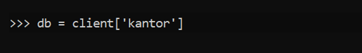
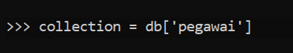
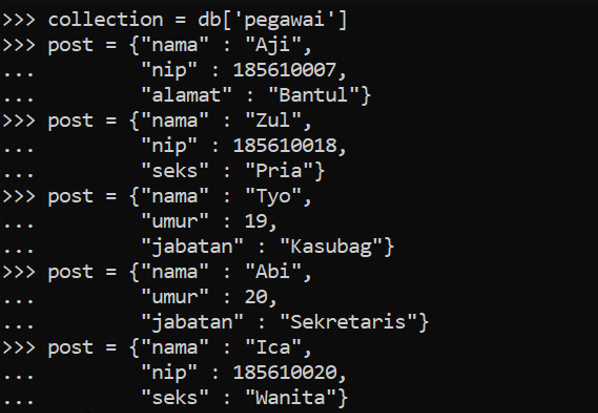
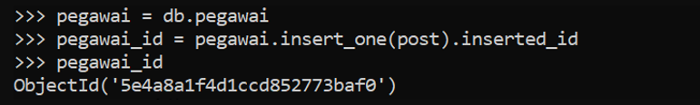
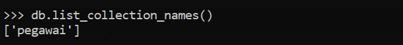

# tekn-basis-data
# Tugas Minggu ke-3
CREATE - MEMBUAT DATABASE

CREATE – MEMBUAT COLLECTION

CREATE - MEMBUAT DOKUMEN

CREATE – MENGINSERT DOKUMEN

READ - MENAMPILKAN SATU DATA DOKUMEN PADA COLLECTION PEGAWAI
UPDATE – MENGUBAH DATA UMUR PADA DOKUMEN DENGAN NAMA
