# tekn-basis-data
# Latihan 
# Cara Menggunakan VirtualBox untuk Mencoba Berbagai OS
Proses instalasi virtual Box
 Download software
 Klik dua kali file yang sudah terdownload
 Klik Next
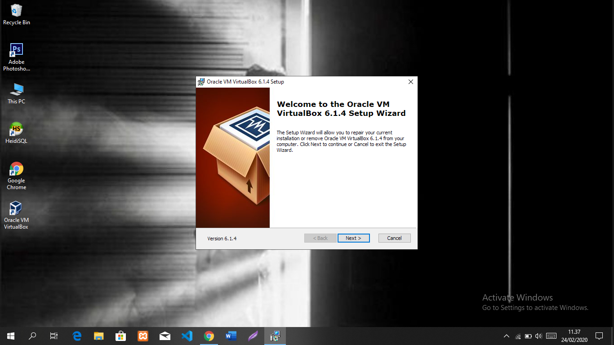
Setelah tampil jendela setup wizard, silakan klik Next
Pilih yang akan diinstal dan klik Nex 
Pilih aplikasi mana saja yang akan digunakan. Dalam contoh ini semua aplikasi akan aku instal. Sehingga tinggal klik Next.Coba lihat pada bagian kanan, maka akan terlihat informasi requirement hardware yang digunakan.
Pilih opsi dan klik Next

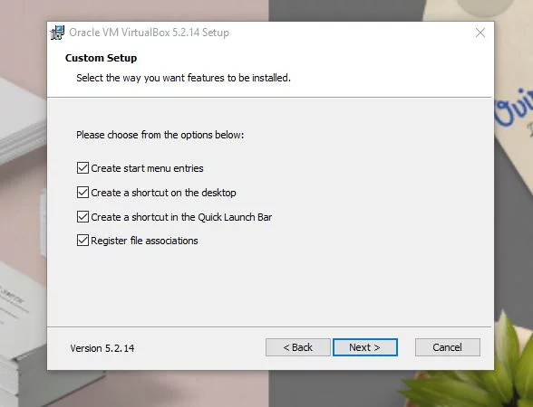

Kamu bisa memilih beberapa hal yang akan terjadi nanti. Kamu bisa memilih untuk mengaktifkan entri dalam menu start, membuat shortcut di desktop, membuat shortcut di Quick Launch Bar dan mendaftarkan file. Kamu bisa menghilangkan semua tanda centang atau memilih semuanya. Dalam hal ini aku memilih untuk mencentang semuanya.
Klik Yes

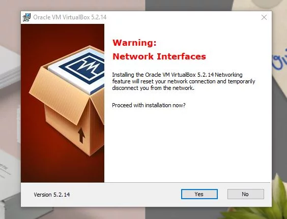

Klik Yes untuk menyetujui bahwa koneksi internet akan diputuskan sementara. Kamu harus memastikan bahwa internet tidak sedang digunakan untuk hal penting karena selama proses awal instalasi, internet akan diputus. Sehingga sebaiknya laptop tidak sedang digunakan untuk mengakses internet yang penting.
 Klik Install untuk memulai proses instalasi

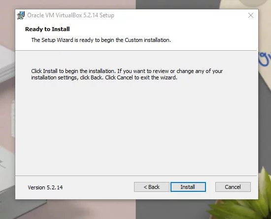
    
Tunggu hingga proses Instalasi selesai

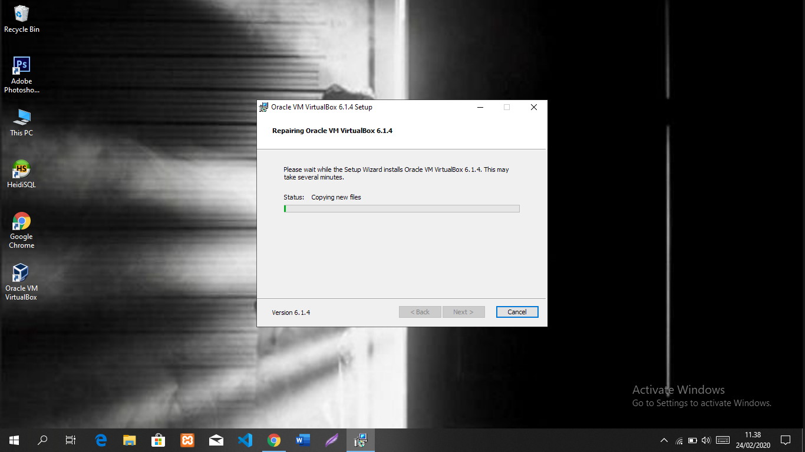

Di tengah proses instalasi akan diminta konfirmasi untuk menginstal satu software tambahan, dalam hal ini aku memilih Install

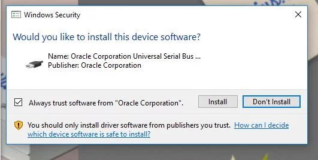

Selesai, klik Finish

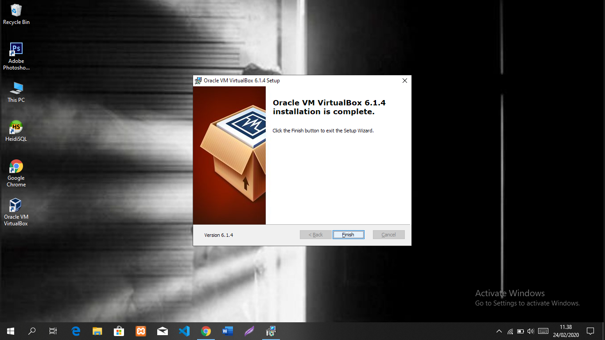

Nah itu tadi langkah-langkah proses instalasi yang sudah cukup panjang. Nah ini tidak serta merta sudah selesai. Justru cara menggunakan VirtualBox baru akan dimulai setelah ini karena yang tadi baru proses untuk memiliki VirtualBox.
# Memasang Sistem operasi tambahan di VirtualBox
Setelah aplikasi terinstal, kamu bisa membuka aplikasinya. Jika kamu tadi memilih untuk memasang shortcut tentu akan mudah untuk menemukan lokasi aplikasi ini. Tampilan dari aplikasi ini memang sangat sederhana sehingga cukup mudah untuk digunakan. Berikut ini langkah demi langkah cara memasang sistem operasi. Masih sama dengan sebelumnya aku menggunakan laptop Asus. Kamu juga bisa menerapkannya misal pada cara menginstal Oracle VM VirtualBox pada debian 9 Stretch.
Buka Aplikasi
Klik New untuk membuat instalasi Sistem Operasi baru

 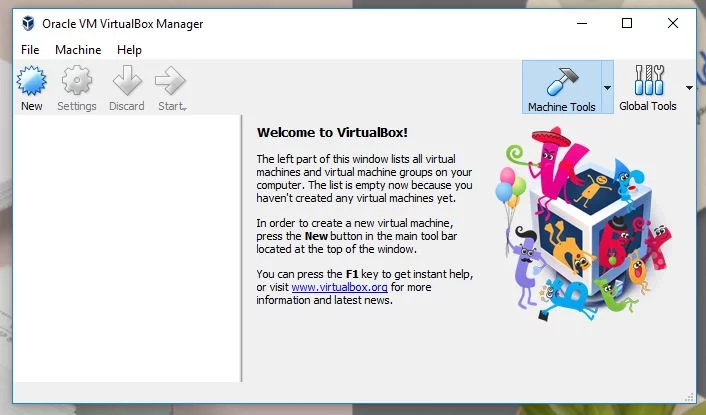

 Berikan nama mesin, pilih tipe sistem operasi dan versi sistem operasi kemudian klik Next

  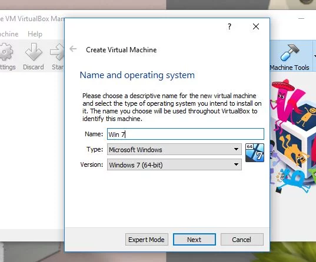

Kamu bisa memberikan nama dengan bebas. Namun menggunakan nama seperti sistem operasi yang akan diinstal tentu saja akan lebih mudah untuk nantinya digunakan. Kemudian untuk type sistem operasi dan versinya bsia dipilih sesuai yang dibutuhkan. Terdapat beberapa pilihan type dan versi yang aku rasa cukup lengkap. Bahkan untuk laptop berbasis Windows pun juga dapat mencicipi sistem operasi Mac OS.
Tentukan berapa besaran RAM yang dialokasikan kemudian klik Next

 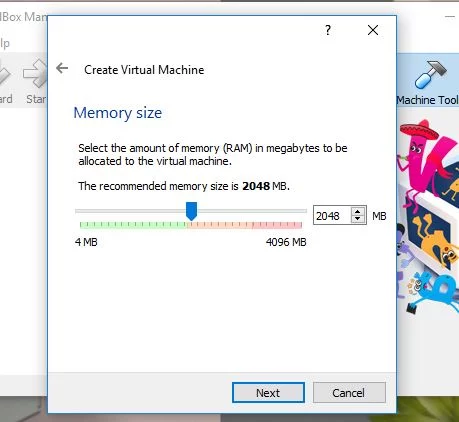

Rekomendasi RAM yang diberikan adalah setengah dari kapasistas RAM laptop. Namun kamu bisa mengaturnya menjadi lebih tinggi atau lebih rendah dari yang disarankan. Sebaiknya jangan lebih tinggi dari yang disarankan karena performa sistem operasi yang asli akan menurun.
Tentukan jenis hardisk yang digunakan kemudian klik Create

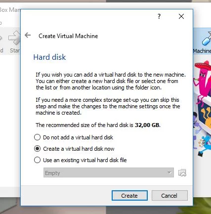

Kamu bisa memilih untuk menggunakan hard disk virtual yang sudah ada, membuat baru atau tidak menambahkan virtual hard disk. Pastikan bahwa ukuran hardisk sesuai yang direkomendasikan atau lebih besar.
Pilih tipe hard disk untuk file kemudian klik Next

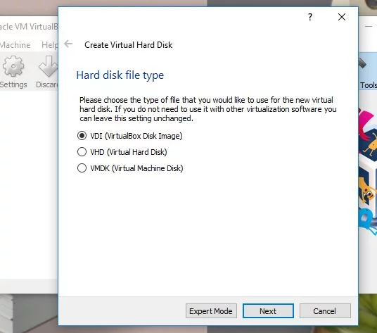

Tentukan penyimpanan pada hard disk fisik, kemudian Next

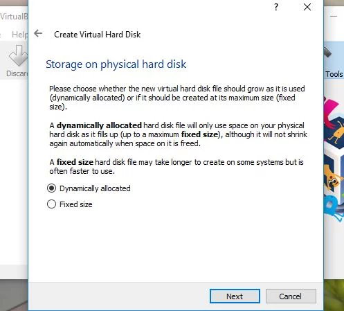

Tentukan lokasi file dan ukurannya, kemudian Next

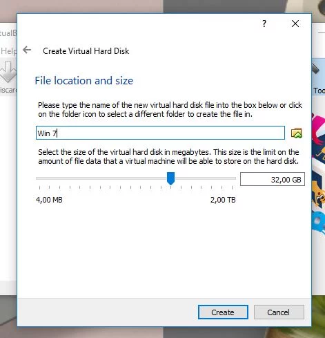

Selesai proses setting
Klik nama mesin yang dipilih, kemudian klik Start
Klik Start untuk memulai proses penggunaan

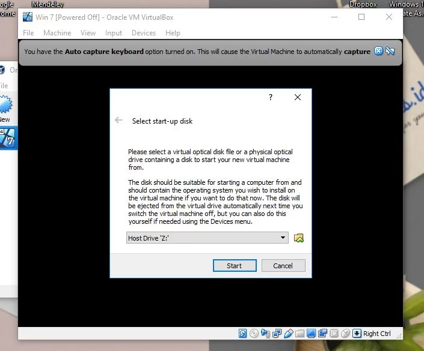

SELESAI INSTAL
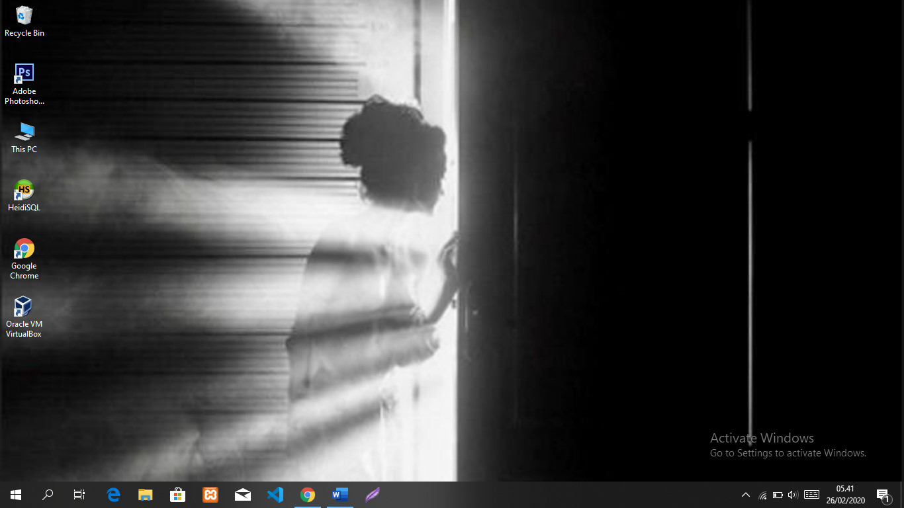
