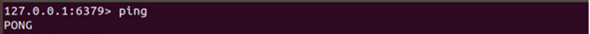
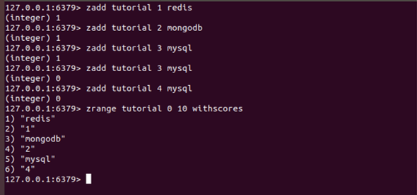
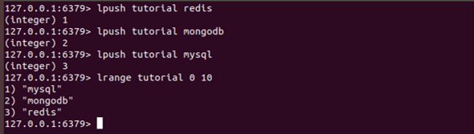
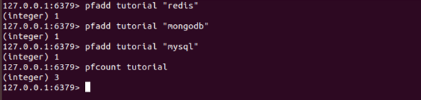
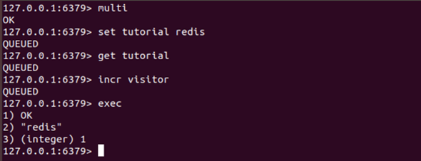
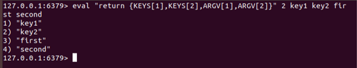

# tekn-basis-data
# tugas
# Kerjakan Redis Quick Guide, untuk bagian instalasi serta redis cli, gunakan Docker.
Instalasi Redis
Cara yang disarankan untuk menginstal Redis adalah mengkompilasi dari sumber sebagai Redis tidak memiliki ketergantungan selain compiler GCC bekerja dan libc. Instalasi menggunakan Manajer paket distribusi Linux
Pertama kita menjalankan di server Redis.
Periksa apakah Redis bekerja
Program eksternal berbicara dengan Redis menggunakan soket TCP dan protokol khusus Redis. Protokol ini diimplementasikan di Perpustakaan klien Redis untuk bahasa pemrograman yang berbeda. Namun untuk membuat hacking dengan Redis sederhana Redis menyediakan utilitas baris perintah yang dapat digunakan untuk mengirim perintah ke Redis. Program ini disebut Redis-cli.

Hal pertama yang harus dilakukan untuk memeriksa apakah Redis bekerja dengan benar adalah mengirim perintah PING menggunakan Redis-CLI:

Menjalankan Redis-CLI diikuti dengan nama perintah dan argumennya akan mengirimkan perintah ini ke instance Redis yang berjalan di localhost di Port 6379. Anda dapat mengubah host dan port yang digunakan oleh Redis-CLI, hanya mencoba opsi--help untuk memeriksa informasi penggunaan.

Cara menarik lainnya untuk menjalankan Redis-CLI adalah tanpa argumen: program ini akan dimulai dalam mode interaktif, Anda dapat mengetikkan perintah yang berbeda dan melihat lipatan mereka.

$ redis-cli
redis 127.0.0.1:6379> ping
PONG
redis 127.0.0.1:6379> set mykey somevalue
OK
redis 127.0.0.1:6379> get mykey
"somevalue"

Pada titik ini Anda dapat menguji jika membangun Anda telah bekerja dengan benar dengan mengetik membuat tes, tapi ini adalah langkah opsional. Setelah kompilasi direktori src di dalam distribusi Redis dihuni dengan executable yang berbeda yang merupakan bagian dari Redis:
Kedua sintaks untuk menggunakan perintah key redis.
DEL sebuah perintah, sedangkan nama adalah key-nya. Jika key dihapus, pengeluaran dari perintah akan menjadi (integer) 1, jika tidak maka akan menjadi (integer) 0.
Ketiga sintaks menggukan perintah Redis.
Empat Di Redis, setiap hash dapat menyimpan hingga lebih dari 4 miliar pasangan nilai bidang.
Lima dapat menambahkan elemen dalam list Redis di bagian atas atau bawah list. Panjang maksimum list adalah 2 32 - 1 elemen (4294967295, lebih dari 4 miliar elemen per list).
Enam panjang maksimum daftar adalah 2 32 - 1 elemen (4294967295, lebih dari 4 miliar elemen per set).

Tujuh Di Redis set yang diurutkan, tambahkan, hapus, dan uji keberadaan anggota di O (1) (waktu konstan terlepas dari jumlah elemen yang terkandung di dalam set). Panjang maksimum daftar adalah 2 32 - 1 elemen (4294967295, lebih dari 4 miliar elemen per set).

Delapan dan Sembilan
Redis Pub / Sub mengimplementasikan sistem pesan di mana pengirim (dalam terminologi redis disebut penerbit) mengirim pesan sementara penerima (pelanggan) menerimanya.

Sepeluh Transaksi redis memungkinkan eksekusi sekelompok perintah dalam satu langkahSemua perintah Pertama dalam transaksi dieksekusi secara berurutan sebagai operasi tunggal yang terisolasi.
Kedua dalam transaksi redis dimulai oleh perintah MULTI dan kemudian Anda harus memberikan daftar perintah yang harus dijalankan dalam transaksi, setelah itu seluruh transaksi dieksekusi oleh perintah EXEC .
Redis scripting digunakan untuk mengevaluasi skrip menggunakan Lua interpreter

Program eksternal berbicara dengan Redis menggunakan soket TCP dan protokol khusus Redis. Protokol ini diimplementasikan di Perpustakaan klien Redis untuk bahasa pemrograman yang berbeda. Namun untuk membuat hacking dengan Redis sederhana Redis menyediakan utilitas baris perintah yang dapat digunakan untuk mengirim perintah ke Redis. Program ini disebut Redis-cli.
$ redis-cli ping
PONG
Hal pertama yang harus dilakukan untuk memeriksa apakah Redis bekerja dengan benar adalah mengirim perintah PING menggunakan Redis-CLI:

