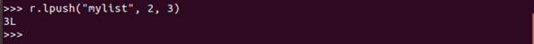
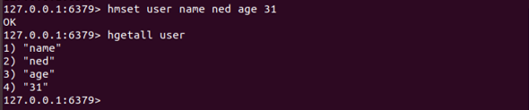

# tekn-basis-data
# Latihan pertama Tentang Hidupkan server Redis
Redis termasuk dalam paket resmi repositori Ubuntu. Namun, untuk mengakses dan menginstallnya, Anda perlu masuk ke server VPS melalui SSH. Setelah berhasil masuk ke server, Anda siap untuk menginstal Redis Ubuntu:
Update Cache APT Repository
Untuk menginstal Redis, Anda perlu mengupdate cache repositori APT Ubuntu Anda. Anda dapat melakukannya dengan command:
Kemudian user menginstal python dengan source codenya sudo apt install python-pip.

Sekarang, Anda dapat memasukkan beberapa shell, yang mana dapat menghubungkan kembali dengan  perintah Python redis dan perintah redis biasa dengan  menginstall redis-py.Tekan y dan enter untuk melanjutkan.
sudo apt install redis Didalam dokumen connect.py user menginputkan query seperti pada gambar dibawah agar saat mengecek Untuk memastikan apakah Redis telah terinstal koneksi antara redis dan pyton dan terhubung maka akan menampilkan “Connection to redis jas beend established” jika tidak terhubung maka akan menampilkan “Cannot connection to redis”.

 
Menginstal Redis pada Ubuntu cukup mudah.jika sudah terhubung dengan redisnya dan pyton Kemudian user mengakses  dan masuk pada python, python siap dijalankan. 
dengan pertemuan yang pertama dapat masukan user dapat menjelaskan dan melakukan penginstalan redis pada terminal linux, disini user langsung mengakses dan masuk pada redis pada terminal.

# Latihan Kedua tentang Kerjakan Materi dan Penjelasan 2, 3 dan 4

STRING Pada perintah redis dapat mengatur nilai string, user menggunakan yang berikut dari redis-cli

Coba dapatkan "mykey", yang diset menggunakan redis-cli dari Python. Output menampilkan hasil yang sama pada redis dimana python dapat berkomunikasi dengan benar dengan redis-server. merupakan redis untuk menggunakan redis-cli dapat dibaca menggunakan Python.

Dapat mengatur nilai ke Redis dari Python shell.

Dapat di lihat dari redis-cli apakah kunci ini disetel dengan benar.

INCR dan INCRBY Redis juga menyediakan incr dan incrby pada nilai integer. Disini user akan mencoba menetapkan nilai integer setara redis-py dari Redis 'incr adalah ntuk Menampilkan untuk memverifikasi bahwa num telah bertambah.

User untuk memastikan dengan mengecek menggunakan redis-cli.

Python dengan incrby

User untuk memastikan dengan mengecek lagi menggunakan redis-cli.

Dapat dilihat dengan EXISTS

DEL Saat kunci dapat  dihapus pada python, maka kita akan mendapatkan "nihil" dan "Tidak Ada" jika Anda mencoba mengambilnya pada redis selanjutnya untuk EXPIRE Tandai key second_num untuk kedaluwarsa setelah 10 detik

EXPIRE

REDIS LISTS Redis lpush sama dengan menggunakan Python

User ini dapat memastikan dan mengecek atau verifikasi bahwa list dibuat diredis

kemudian menambahkan beberapa nilai ke list

Periksa daftar baru dari redis-cli

lihatlah dan periksalah daftar baru dari Python

lanjut dengan rpush

Periksa elemen yang didorong ke kanan

REDIS HASHES hmset memungkinkan penyimpanan kamus sebagai nilai. Ini sama seperti pada redis docs.

redis-py cara mencapai hal yang sama dapat Memastikan yang diinput pada python ini menggunakan redis-cli

Menampilkan ini menggunakan redis-py

Materi dan Penjelasan 3
Materi dan Penjelasan 4 Pada materi dan penjelasan dibagian 3 yaitu menulis sebuah program dengan python yang membutuhkan lima langkah dasar yaitu: 
-impor redis tentukan informasi koneksi untuk redis, membuat objek koneksi redis, mengatur pesan ke redis, mengambil pesan redis dan menampilkan pesan tersebut. 
Yang Pertama- tama pada shell unix python, disini user membuat dokumen baru dengan nama python3.py yang didalamnya akan berisi skrip untuk mengimplementasikan lima langkah tersebut seperti dibawah ini:

Dari kode ini, user dapat memodifikasi kode tersebut menggunakan metode set dan get untuk menggunggah data yang berbeda. Dari program ini kita dapat bereksperimen dengan beberapa tipe data redis lain yang ditautkan diatas.