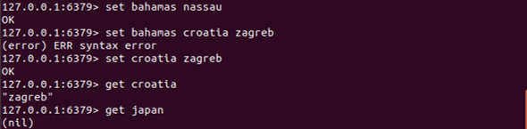
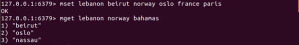
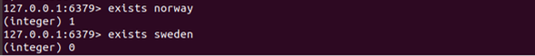

# tekn-basis-data
# Tugas Kerjakan sesuai dengan artikel dari RealPython.com
Pada tugas dimulai menggunkan contoh database pemetaan negara dengan menggunakan set untuk mengatur pasangan nilai kunci dengan redis.

Urutan pernyataan yang sesuai dalam Python

Redis mempunyai  beberapa nilai kunci dalam satu perintah, MSET dan MGET

Python adalah dengan dict.update

Selanjutnya menggunakan untuk meniru perilaku Redis untuk mengembalikan nilai seperti null ketika tidak ada kunci yang ditemukan. Sebagai contoh ketiga, perintah EXISTS yaitu memeriksa apakah ada kunci pada database

Python memiliki kata kunci in untuk menguji hal yang sama, yang rute ke dict.contains(key):

Dari contoh di aatas dapat menggunakan Python asli, apa yang terjadi pada tingkat tinggi dengan beberapa perintah Redis yang umum.Tidak terdapat komponen client-server di sini untuk contoh Python, dan redis-py belum memasukkan gambar. Ini hanya dimaksudkan untuk menunjukkan fungsionalitas Redis dengan contoh.