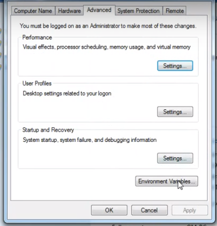

# tekn-basis-data
# latihan Install Apache Cassandra hinggal bisa dijalankan server dan cqlsh
Cara pertma menginstal OpenJDK yang telah saya download pada link github praktikum atau bisa diakses di link OpenJDK. Langkah penginstalan ada dibawah ini. setelah  program sudah selesai didownload, open file instalasi OpenJDK kemudian klik next.

Kemudian pada END-USER LICENSE AGREEENT klik checkbox/centang pada I accept the terms in the license Agreement.
pada tab CUSTOM SETUP kita menentukan simpanan directori yang akan disimpan saat diinstalasi. Jika sudah klik tombol next.

pada tab CUSTOM SETUP kita menentukan simpanan directori yang akan disimpan saat diinstalasi. Jika sudah klik tombol next

klik supaya dapat dilanjutkan

setelah itu tunggu sampai selesai di proses untuk OpenJDK.

Dapat memastikan kalau aplikasi selesai di install buka cmd lalu klik kode  java.exe -version.

selajutnya kalau sudah terinstaal buka Environment pada Control panel /Pilih Environment Variable

Copykan alamat tempat folder penginstallan jdk dengan cara : Computer > local Disk (c) > program files > java > folder jdk > bin > java Setelah itu klik kanan pada Computer > Properties > Advanced System Settings kemudian Pilih Environment Variable.
Cari variable Path dan pastekan  lokasi penyimpanan folder jdk pada variable value lalu klik ok

Langkah berikutnya user menginstall python. 

Pada menu CUSTOMIZE PYTHON user memilih Will be installed on local hard drive, selanjutnya ikuti petunjuk sampai proses instalasi selesai.lanjut klik next dapat melanjutkan install.

Tunggu sampai selesai  proses.

selanjutnya klik finish otomatis aplikasi pyton sudah terinstall,lanjut langkah selanjutnya.

Langkah ketiga selesai mendownload Apache Cassandra versi 3.11.6, setelah selesai didownload, unzip dan tempatkan pada direktori “C:\Program Files\apache-cassandra-3.11.6-bin”.

kemudiansudah dipindahkan di direktori yang ditentukan, selanjutnya buka Command promp dan masuk ke directori yang ditentukan kemudian ketik Cassandra yang hasilnya seperti ditunjukkan di bawah ini.

Selanjutnya kita lanjut lagi setting CASSANDRA_HOME untuk nama variabel nya dan directori nya arahkan ke C:\cassandra\bin , tampilannya seperti ini

lalu sama seperti langkah sebelumya, dibuat juga path pada system variable dengan mengklik path pada system variabel. Klik new dan browse directory yang sama dengan yang kita buat saat membuat variabel name cassandra_home yaitu di C:\cassandra\bin.

Menjalankan Apache Cassandra
Cara paling dasar untuk berinteraksi dengan Cassandra adalah menggunakan shell CQL yaitu cqlsh. Anda dapat membuat basis data dan tabel, menambah data baru, mencari, mengubah dan menghapus data yang ada. dan masih banyak lagi yang lain.
Untuk menjalankan Cassandra, gunakan powershell atau command prompt.
Untuk memulai shell CQL, ketikkan cqlsh, tekan Enter.

Shell siap menerima perintah CQL (Cassandra Query Language). Misalnya, dengan mengetikkan help akan tampil layar berikut.

Selanjutnya kita coba membuat tabel di dalamnya. untuk langkah Pertama-tama buat namespace tempat data disimpan.

