# tekn-basis-data
# latihan (Download Apache Tinkerpop, ambil Gremlin Server serta Gremlin Console)
Pada latihan ini yang pertama mendownload Apache Tinkerpop yang di ambil dari Gremlin Server serta Gremlin Console yang akses di Dokumentasi Apache TinkerPop pada penjelasan dan materi di pertemuan 8.
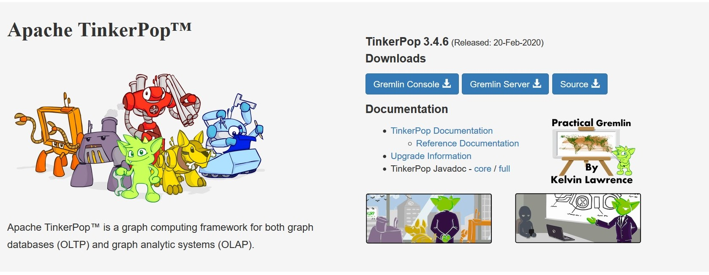
Untuk mendownload klik Gremlin console, maka akan muncul halaman web baru seperti gambar dibawah lalu klik link . Lakukan hal yang sama untuk mendownload gremlin server.

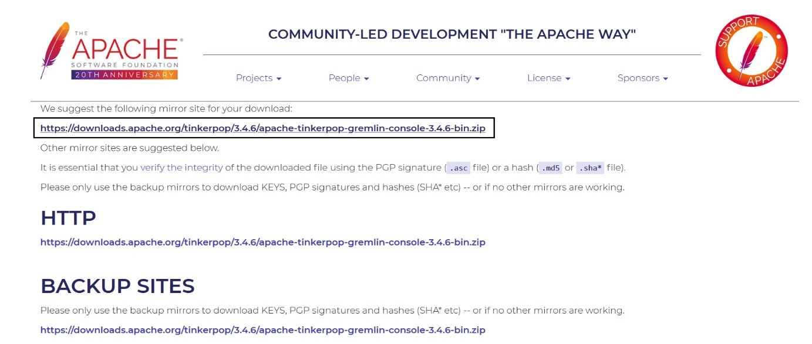

# Latihan 2 (Kerjakan dan pahami Getting Started)

selanjutkan ke tahap latihan getting started, pastikan kita sudah menginstal JDK sesuai dengan versinya dimana sesuai yang diminta yakni JDK 8 - minimal 1.8.0_45, versi sebelum 1.8.0_45 tidak didukung Apache TinkerPop.
setelah itu buka cmd.

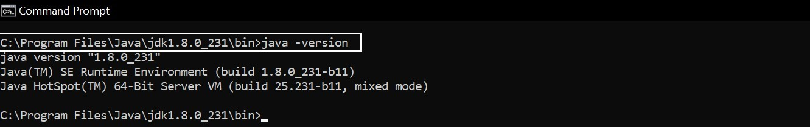

kemudian lanjutkan untuk masuk dan akses ke gremlin dimana masuk pada command promp dengan run administrator, kemudian masuk ke direktori dimana gremlin console disimpan. Jika sudah masuk ke direktori bin maka telusuri file dengan nama gremlin.bat di coppy nama file dan masukan pada command promp dengan run administrator. apabila tampilan sudah sama seperti gambar dibawah berarti sudah bisa mengakses gremlin.

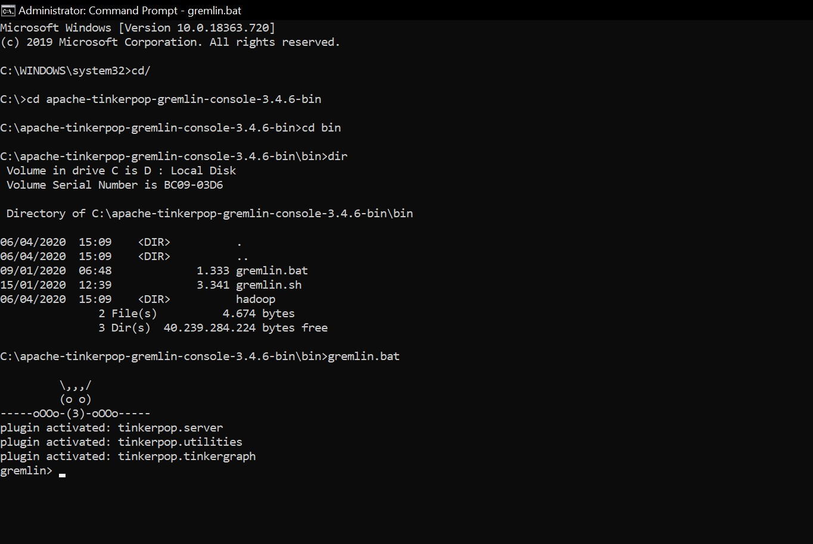

GREMLIN Console adalah lingkungan REPL , yang menyediakan cara yang baik untuk mempelajari GREMLIN ketika Anda mendapatkan umpan balik segera untuk kode yang Anda masukkan. Ini menghilangkan kebutuhan yang lebih kompleks untuk "membuat proyek" untuk mencoba berbagai hal. Konsol bukan hanya untuk "memulai". Anda akan mendapati diri Anda menggunakannya untuk berbagai aktivitas yang berhubungan dengan TinkerPop, seperti memuat data, mengelola grafik, dan mengerjakan jalur rumit. Untuk membuat GREMLIN melintasi grafik, Anda memerlukan instance TraversalSource , yang menyimpan referensi ke instance Graph , yang pada gilirannya menyimpan struktur dan data grafik. TinkerPop adalah lapisan abstraksi grafik pada basis data grafik dan prosesor grafik yang berbeda, sehingga ada banyak instance Graph yang dapat Anda pilih untuk memulai koneksi ke konsol. Contoh Graph terbaik untuk memulai, adalah TinkerGraph . TinkerGraph adalah basis data grafik yang cepat di dalam memori dengan sejumlah kecil opsi konfigurasi, menjadikannya pilihan yang baik untuk pemula.

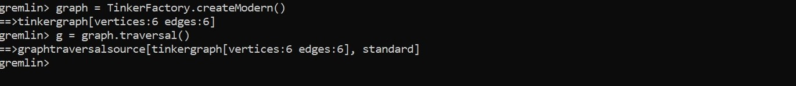

Ada beberapa cara TraversalSource. Contoh di bawah menggunakan pendekatan terbatas untuk bahasa menggunakan Java Virtual Machine (JVM). Dengan TraversalSource yang tersedia, sekarang memungkinkan untuk meminta GREMLIN untuk melintasi Grafik : • Dapatkan semua simpul dalam Grafik. • Dapatkan simpul dengan pengidentifikasi unik "1". • Dapatkan nilai properti name pada titik dengan pengidentifikasi unik "1". • Dapatkan tepi dengan label "knows" untuk titik dengan pengidentifikasi unik "1". • Dapatkan nama-nama orang yang memiliki simpul dengan pengidentifikasi unik "1" "knows". • Perhatikan bahwa ketika seseorang menggunakan outE (). InV () seperti yang ditunjukkan pada perintah sebelumnya, ini dapat disingkat menjadi just out () (mirip dengan inE (). OutV () dan in () untuk tepi yang masuk). • Dapatkan nama orang-orang vertex "1" tahu siapa yang berusia di atas 30.

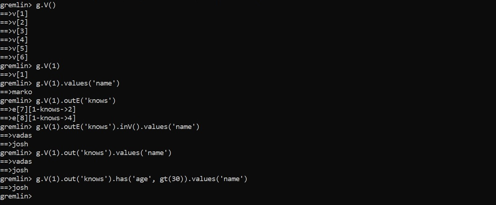

selanjutnya membuat grafik pada gremlin untuk mengembangkan traversal, seperti pada contoh dibawah. Ada beberapa hal penting yang perlu diperhatikan dalam kode tersebut. Pertama, ingat bahwa id "dicadangkan" untuk penggunaan khusus di TinkerPop. Ini adalah anggota enum, T. "key" yang disediakan untuk metode pembuatan itu diimpor secara statis ke konsol, yang memungkinkan Anda untuk mengaksesnya tanpa harus menentukan enum sendiri. 
Kedua, jangan lupa bahwa Anda bekerja dengan TinkerGraph, yang memungkinkan penugasan pengidentifikasi. Itu tidak terjadi pada kebanyakan basis data grafik. Akhir dari, label untuk Edge diperlukan dan karenanya merupakan bagian dari tanda tangan metode addEdge (). Penggunaan addEdge ini menciptakan sisi yang keluar dari v1 dan ke v2 dengan label.

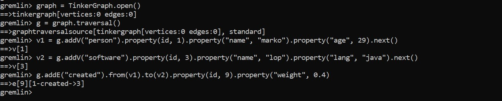

kemudian secara idiomatis dengan memasukkan label titik sebagai bagian dari filter untuk memastikan bahwa kunci properti "nama" mengacu pada titik "orang". Hasil yang Kita dapat menggambarkan traversal ini dalam grafik dengan GREMLIN duduk di puncak "1".

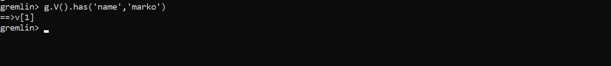

langkah berikutnya dalam traversal di mana kita memintanya untuk "berjalan" dan "membuat" tepi ke simpul "perangkat lunak". Seperti yang dijelaskan sebelumnya, jadi kami harus memberi tahu GREMLIN arah mana yang harus diikuti. Dalam hal ini, kami ingin dia menelusuri tepi keluar dari titik "marko". Untuk ini, kami menggunakan langkah outE.

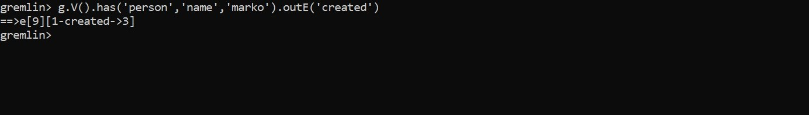

Untuk sampai ke titik di ujung yang lain dari tepi, kita perlu memberitahu GREMLIN untuk bergerak dari tepi ke titik yang masuk dengan inV ().Karena kita tidak meminta GREMLIN untuk melakukan apa pun dengan properti dari tepi "create".

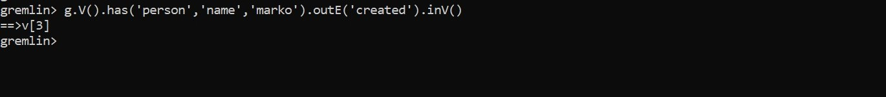

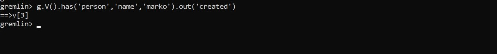

sekarang GREMLIN telah mencapai "perangkat lunak yang dibuat Marko", ia memiliki akses ke properti dari vertex "perangkat lunak" dan karena itu kita dapat meminta GREMLIN untuk mengekstraksi nilai properti "nama".gambar di bawah

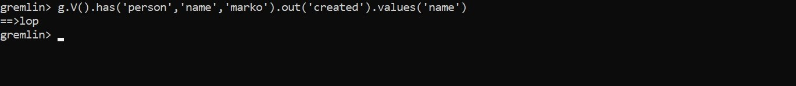

selanjutnya  kita dapat melihat koneksi yang dimiliki GREMLIN ke struktur grafik dan bagaimana GREMLIN bermanuver dari simpul ke tepi dan sebagainya.Sebelumnya kita telah menggunakan has () - langkah untuk memberi tahu GREMLIN bagaimana menemukan titik "marko".

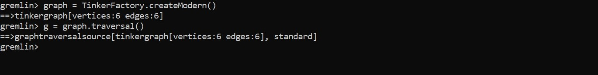

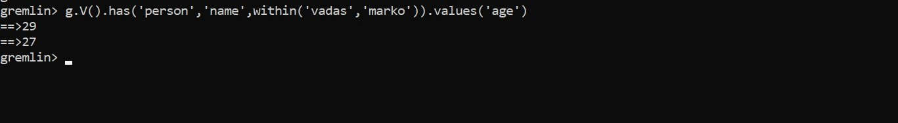

Metode penyaringan lainnya terlihat dalam penggunaan langkah di mana kita menemukan "perangkat lunak" yang "marko" buat kita dapat melihat bahwa "peter", "josh" dan "marko" semua bertanggung jawab untuk membuat "v [3]", yang merupakan simpul "perangkat lunak" bernama "lop".

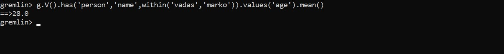

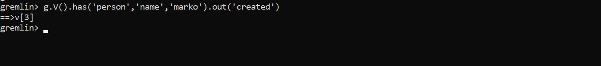

selanjutnya membuat dua tambahan pada traversal untuk membuatnya mengecualikan "marko" dari hasil. Pertama, kita menambahkan langkah as (). Langkah as () - sebenarnya bukan "langkah", tetapi "modulator langkah" - sesuatu yang menambahkan fitur ke langkah atau traversal. Di sini, as ('kecualikan') memberi label has () - langkah dengan nama "kecualikan" dan semua nilai yang melewati langkah itu disimpan dalam label itu untuk digunakan nanti. Dalam hal ini, simpul "marko" adalah satu-satunya simpul yang melewati titik itu, sehingga disimpan dalam "kecualikan".

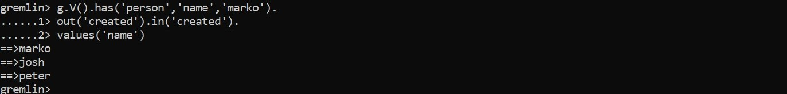

GREMLIN akan memberi label pada masing-masing simpul di jalur itu dengan "a", "b" dan "c". kemudian dapat menggunakan pilih untuk mengekstraksi isi label itu.

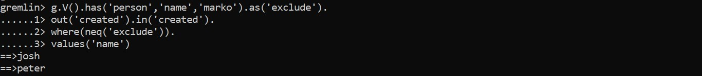

Kemudian Untuk membuatnya lebih bagus, kita meminta GREMLIN untuk memberi nilai properti "nama" dari simpul-simpul itu, dengan memasok yang lain dengan () modulator ke grup () untuk mengubah nilai.

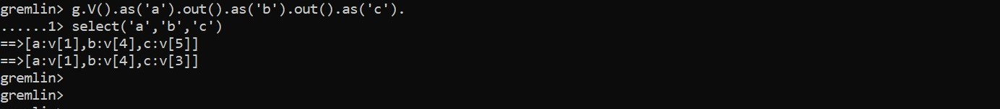

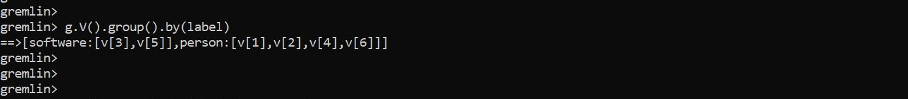

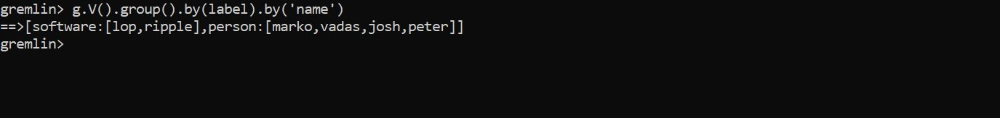

