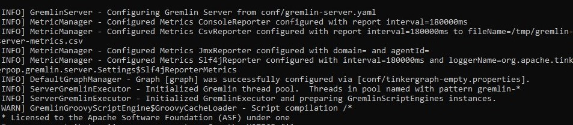

# tekn-basis-data
# Latihan 1
# Install driver Gremlin-Python menggunakan petunjuk pada Materi dan Penjelasan nomor 1
langkah pertama membuka command prompt. dan masukan isi pip install gremlinpython untuk menginstall driver gremlin-python command prompt . hingga beberapa saat untuk selesai download. setelah itu, membuka python dengan cara “py”.

kemudian gremlin console dengan cara buka di command prompt, buka direktori yang dimana di simpan aplikasi  gremlin.bat .

menghidupkan gremlin server, masuk ke tempat disimpan dan isi dengan gremlin-server.bat

# Latihan 2
# (Kerjakan dan jalankan Materi dan Penjelasan nomor 2. Jelaskan program tersebut dalam kaitannya dengan graph, vertex, edge)
Langkah pertama import traversal pada class gremlin python, driverremoteconnection dan json untuk javascript kemudian buat method main yang didalam nya untuk mengkoneksikan gremlin dengan python. dari pada relational database, graph database sering lebih cepat himpunan data asosiatif, dan memetakan lebih langsung ke struktur aplikasi berorientasi object-oriented application. Jadi keterkaitan antaran graph, vertex dan edge adalah ketiga komponen tersebut adalah termasuk ke dalam graph computer untuk membuat database berbasis grapik.

